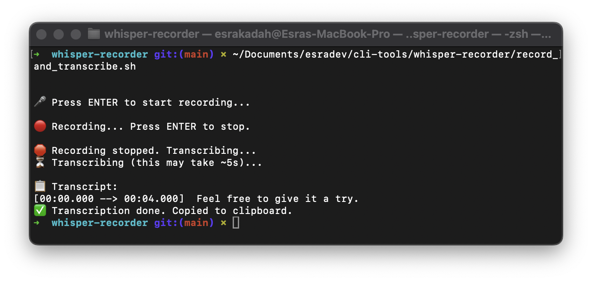

# 🎙️ Esra Whisper Recorder (Minimal Version)

A lightweight, no-frills CLI voice recorder and transcriber using OpenAI Whisper + SoX for macOS.  
Run → Speak → Get your text → Done.

## ✅ What it does

- Records your voice using SoX.
- Transcribes using [Whisper](https://github.com/openai/whisper) (`small` model).
- Copies the result to your clipboard (`pbcopy`).
- Shows the text in your terminal output.
- Requires **no GUI**, no manual file cleanup, no post-processing.

## Demo

Here’s what it looks like:



---

## 🛠️ Setup (macOS only)

1. **Install dependencies:**

```bash
brew install sox ffmpeg
python3.11 -m venv ~/whisper-env
source ~/whisper-env/bin/activate
pip install --upgrade pip setuptools-rust wheel
pip install git+https://github.com/openai/whisper.git
```

2. **Make your script executable:**

```bash
chmod +x record_and_transcribe.sh
```

3. **Run the script:**

```bash
source ~/whisper-env/bin/activate
./record_and_transcribe.sh
```

---

## ⚙️ How it works

```bash
🎤 Press ENTER to start recording
🔴 Recording... Press ENTER to stop
🛑 Recording stopped. Transcribing...
📋 Transcript: [shown in terminal]
✅ Copied to clipboard
```

All temporary files (`.wav`, `.txt`, `.json`, etc.) are stored in a `tmp/` folder.
🧹 You can delete the `tmp/` folder anytime. It’s just scratch space.


---

## 🔍 Why it's minimal

This tool was made for personal use — quick idea capturing and voice transcription with no loops, no UI, and minimal dependencies.  
If you'd like to add hotkey triggers, auto-cleanup, or loops, feel free to fork and iterate.

### Temporary Files

All output files (audio and transcription artifacts) are stored inside a `tmp/` folder.
You can delete this folder at any time — it won’t affect the tool.

To ignore it from Git versioning, it's already listed in `.gitignore`.

---

## ✨ Community

This project was released freely as a small helper tool.  
Raise a PR if you have ideas — otherwise, use it as-is and enjoy.

Built with love by [@esrakadah](https://github.com/esrakadah) 💛
