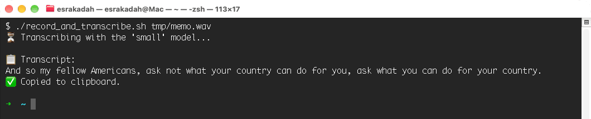

# 🎙️ Esra Whisper Recorder

A one-file voice-to-text tool for the macOS command line: record with SoX, transcribe offline with
[OpenAI Whisper](https://github.com/openai/whisper), get the text in your terminal and on your clipboard.

Run, press ENTER, speak, press ENTER, paste.

## ✅ What it does

- Records your voice with SoX (16 kHz mono, what Whisper expects).
- Transcribes it with Whisper (`small` model by default, language detected automatically).
- Prints the transcript and copies it to the clipboard with `pbcopy`.
- Cleans up after itself: recordings live in a temporary folder that is deleted when the script exits.
- If anything fails, it says so and **leaves your clipboard untouched**.

```text
🎤 Press ENTER to start recording...
🔴 Recording... Press ENTER to stop.
🛑 Recording stopped.
⏳ Transcribing with the 'small' model...

📋 Transcript:
And so my fellow Americans, ask not what your country can do for you, ask what you can do for your country.
✅ Copied to clipboard.
```



*A real run on a sample clip, passed as a file. A recording looks the same after the two ENTER prompts.*

---

## 🔐 Privacy & offline mode

After setup, transcription runs entirely on your Mac. Your voice is never sent anywhere.

The **first run of each model downloads it** (about 480 MB for `small`) into `~/.cache/whisper/`. From then
on no network connection is needed.

---

## 🛠️ Setup (macOS)

```bash
brew install sox ffmpeg python@3.11
git clone https://github.com/esrakadah/esra-whisper-recorder.git
cd esra-whisper-recorder

python3.11 -m venv ~/whisper-env
~/whisper-env/bin/pip install --upgrade pip
~/whisper-env/bin/pip install openai-whisper==20250625
```

Tested with Python 3.11 and `openai-whisper` 20250625. Older releases such as 20240930 no longer build with
current setuptools.

Then run it:

```bash
./record_and_transcribe.sh
```

No `source activate` is needed: the script finds `whisper` on your `PATH`, or falls back to
`~/whisper-env/bin/whisper`.

---

## ⚙️ Options

```bash
./record_and_transcribe.sh                 # record, transcribe, copy
./record_and_transcribe.sh memo.wav        # transcribe an existing file instead of recording
./record_and_transcribe.sh --keep          # keep the recording and transcript; the folder is printed
WHISPER_LANG=de ./record_and_transcribe.sh # force a language (en, de, tr, ...)
```

| Variable | Default | What it does |
|---|---|---|
| `WHISPER_MODEL` | `small` | `tiny` and `base` are faster, `medium` and `large` more accurate |
| `WHISPER_LANG` | detected | Set it when Whisper guesses the wrong language for short clips |
| `WHISPER_BIN` | `whisper` on `PATH`, else `~/whisper-env/bin/whisper` | Use another Whisper install |

**Speed:** this is the reference Whisper, which runs on the CPU on Macs. An 11-second clip takes about
20 seconds with `small` on an Apple Silicon Mac. Use `WHISPER_MODEL=base` or `tiny` when speed matters more
than accuracy.

---

## 🔍 Why it's minimal

Made for personal use: quick idea capture with no loops, no UI and two dependencies: SoX, and Whisper (which
needs ffmpeg).

In 2026 there are faster options on Apple Silicon: [whisper.cpp](https://github.com/ggml-org/whisper.cpp)
(Metal, no Python), [mlx-whisper](https://pypi.org/project/mlx-whisper/), or macOS's built-in dictation. This
repository stays the minimal, readable reference.

---

## ✨ Community

Small fixes are welcome as PRs; for anything bigger, see [CONTRIBUTING.md](./CONTRIBUTING.md).

Built with love by [@esrakadah](https://github.com/esrakadah) 💛
